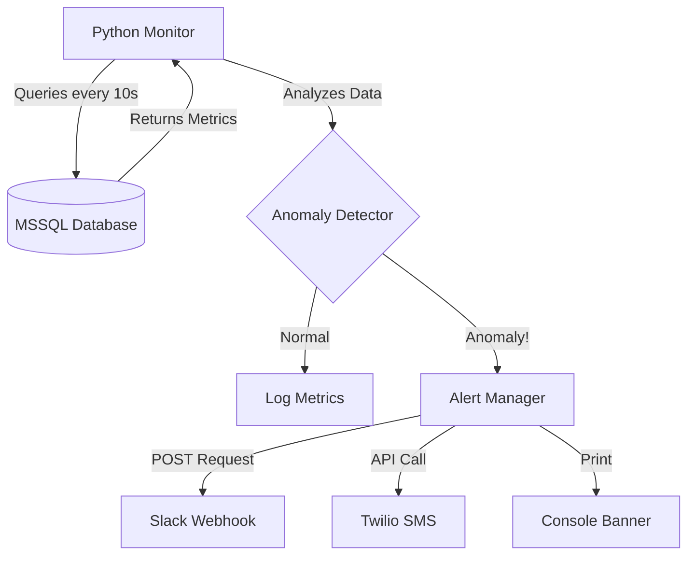

# SentinelDB

**Real-Time Performance & Anomaly Monitor**

 SentinelDB is a proactive database monitoring tool designed to detect "unusual behavior" before it impacts availability. It tracks database heart rate in real-time and uses statistical analysis (Z-score) to identify anomalies.

## 🚀 Features

*   **Real-time Monitoring**: Queries system metadata (`sys.dm_exec_requests`) every 10 seconds.
*   **Metric Tracking**:
    *   Active Connections
    *   CPU Load
    *   Long-Running Queries (> 5000ms)
*   **Anomaly Engine**: 
    *   Sliding Window: Stores last 50 readings.
    *   Detection Rule: `Current > (Mean + 2 * StdDev)`.
*   **Alerting**: 
    *   Console: Big Red ASCII Banner.
    *   Channels: Slack Webhook / Twilio SMS.

## 🛠 Tech Stack

*   **Language**: Python 3.8+
*   **Database**: MSSQL (via `pyodbc`)
*   **Libraries**: `numpy` (stats), `requests` (webhooks), `python-dotenv`
*   **Architecture**: Polling Loop -> Data Collector -> Anomaly Detector -> Alert Manager

## 🏗 Architecture



## 📦 Installation

1.  Clone the repository.
2.  Install dependencies:
    ```bash
    pip install -r requirements.txt
    ```
3.  Configure `.env` (copy from `.env.example`).
    *   Ensure `long_running_query_threshold_ms` is set to `5000`.

## 🎮 How to Demo (The "Proof")

1.  **Start the Monitor**:
    ```bash
    python src/main.py
    ```
    *You will see it logging normal metrics.*

2.  **Attack the Database** (in a separate terminal):
    Run the included stress test to simulate a traffic spike and slow queries:
    ```bash
    python src/stress_test.py
    ```

3.  **Watch the Fireworks**:
    *   The monitor will detect the spike in connections and CPU load.
    *   A **CRITICAL ALERT** banner will appear in the console.
    *   If configured, you will receive a Slack/SMS notification.
